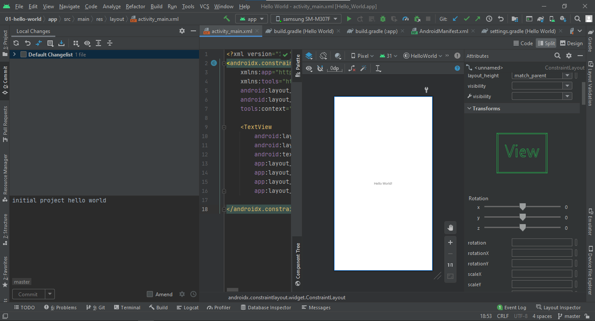

# Project Hello World Android Studio

Tugas 1: Membuat project hello world di Android Studio, lalu push ke repository GitHub Anda dg nama hello-world-android

Kumpulkan link repo tsb ke LMS!

## Screenshot Hasil Praktikum

